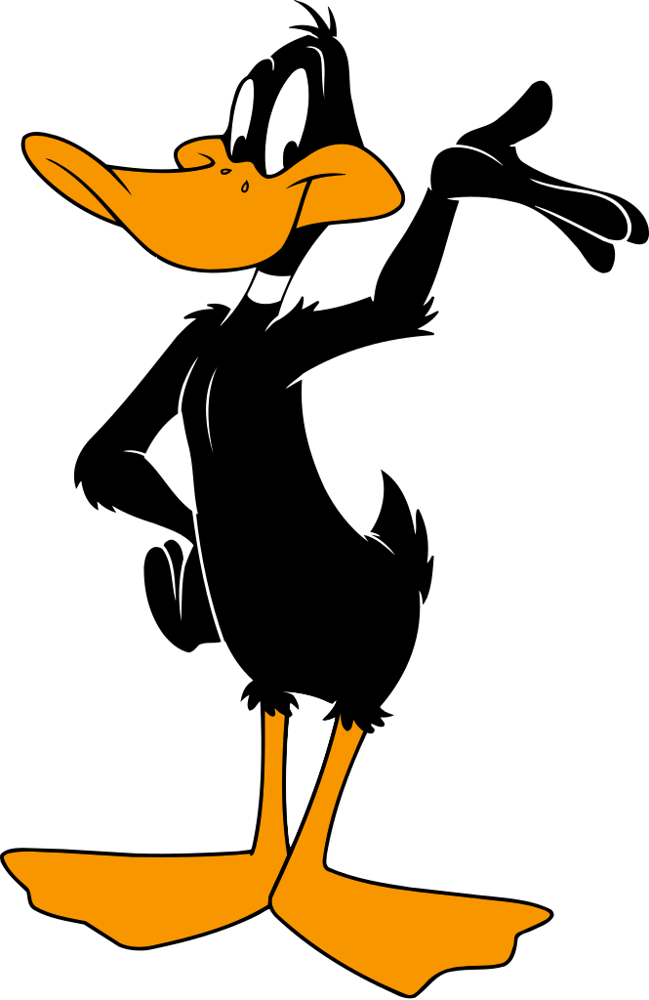

## Hi Folks! 👋

### 

🖥️ Software Engineer   🦾 Automation Engineering student   🎮 Game Dev   🤖 Learning Machile Learning     Developer at [Beta2Games](https://www.beta2games.com/)  [Hydrone](https://www.linkedin.com/company/hydrone123) Researcher  

 
 

## 🖋️ Languages & Tools:

  
  
  
  
  
  
  
  
  

## 📬 Let's Connect!

  
